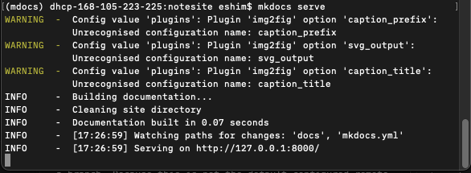

## Create directory structure.

```bash
# Define the core directory
dircore="/Users/eshim/scidev"
direnvs="${dircore}/envsdir"
dirmdoc="${direnvs}/mdocs"
dirasst="${dircore}/assets"
dirpckg="${dirasst}/packges"
filecore="corefile.md"
# Make Dirs
mkdir -p "$direnvs"
mkdir -p "$dirmdoc"
mkdir -p "$dirasst"
mkdir -p "$dirpckg"
```

Tips:
1. When doing the BASH variable assignment, the `=` symbol should not have spaces on either side.
2. (CB) In this code, the directories `direnvs` and `dirmdoc` are created using the `mkdir` command with the `-p` option. The `-p` option ensures that parent directories are created if they don't already exist. The variable values are correctly concatenated using the `${variable}` syntax.
3. Pick up the command line tool `tree` to visualize the directory structure: 		

---

# Use Homebrew to intstall the CLI Tool `tree`

## Verify Homebrew Installation
```bash
# Check for Homebrew
which brew
# Output:
#   /usr/local/bin/brew
# 
# Check Homebrew Version ia > 4.0
brew --version
# Output
    # lifenotes eshim$ Homebrew 4.0.27
    # Homebrew/homebrew-core (git revision e1774d6544; last commit 2023-07-06)
```

If `which brew` returns nothing, or `brew --version` is below 4.0, then Update Homebrew

# Installing/Updating CLI Utils with Homebrew

## Install the Homebrew tool via the website

```bash
# Get Homebrew Install from GitHub
/bin/bash -c "$(curl -fsSL https://raw.githubusercontent.com/Homebrew/install/HEAD/install.sh)"
```

### Homebrew Installation Output

```bash
/bin/bash -c "$(curl -fsSL https://raw.githubusercontent.com/Homebrew/install/HEAD/install.sh)"
# Output:
#   ==> Checking for `sudo` access (which may request your password)...
#   `Password:
#   ==> This script will install:
#   /opt/homebrew/bin/brew
#   /opt/homebrew/share/doc/homebrew
#   /opt/homebrew/share/man/man1/brew.1
#   /opt/homebrew/share/zsh/site-functions/_brew
#   /opt/homebrew/etc/bash_completion.d/brew
#   /opt/homebrew
#
#   Press RETURN/ENTER to continu
```

### Homebrew Installation Errors

If tou have errors of the form: `Warning: /opt/homebrew/bin is not in your PATH.`
1. Add `/opt/homebrew/bin` to your $PATH.
```bash
PATH="$PATH:/opt/homebrew/bin"
```

## Install `tree` with Homebrew
```bash
# Use homebrew to install tree
brew install tree
```

--- 		

# Create a python3 virtual environment (`venv`) to run Mkdocs

## Create the `python3` `venv` and start it with `source`

```bash
# Create the python3 venv
python3 -m venv "${dirmdoc}"
# Activate the venv
source "${dirmdoc}/bin/activate"
# Go there
cd ${dircore}
```

### Tips: python3 venv

1. Notice that the variable is wrapped in "" because the command input should be a string
2. CB: By using the -m (there is no long-form version) flag followed by the module name (venv), you are instructing the Python interpreter to execute the venv module's script functionality. This allows you to create a virtual environment using the python3 -m venv command, without explicitly running a separate Python script or invoking a specific Python file.

## Configure python3 `venv` with `pip`

Now we are working in the python3 environment where lines should be preceded by `(mdocs) hostname:scidev username$`
```python
# Upgrade pip so that it doesn't complain
python3 -m pip install --upgrade pip

# install the local Mkdocs package, version 1.4.3
python3 -m pip install "/Users/eshim/scidev/assets/packages/mkdocs-1.4.3.tar.gz"
```

Then create the MkDocs project directory in the python3 venv
```python
mkdocs new "/Users/eshim/scidev/notesite"
cd /Users/eshim/scidev/notesite
mkdocs serve
```
And you get output:
```
INFO     -  Building documentation...
INFO     -  Cleaning site directory
INFO     -  Documentation built in 0.06 seconds
INFO     -  [10:50:41] Watching paths for changes: 'docs', 'mkdocs.yml'
INFO     -  [10:50:41] Serving on http://127.0.0.1:8000/
```
It will serve on [Your local Macine](http://127.0.0.1:8000/)
Now leave this Terminal instance running and let it update the site in the background. I will call this the Mkdocs Server Terminal or similarly.

**Open a new terminal window**

Get an example page from Mkdocs and send it to the Mkdocs website directory `notesite`
```bash
curl 'https://jaspervdj.be/lorem-markdownum/markdown.txt' > /Users/eshim/scidev/notesite/docs/about.md
```

In the Mkdocs Server Terminal you will see an update as it adds the new webpage:
```
INFO     -  [11:36:50] Detected file changes
INFO     -  Building documentation...
INFO     -  Documentation built in 0.07 seconds
INFO     -  [11:36:50] Reloading browsers
INFO     -  [11:36:50] Browser connected: http://127.0.0.1:8000/
```

Edit the `mkdocs.yml` file in `~/scidev/notesite`
```yaml
site_name: Super Fun Digressions # site_name and site_url are the only required fields
site_url: https://example.com # https://example.com is a placeholder value
nav: 
    - Home: index.md
    - About: about.md
```
Install the mkdocs plugin `img2fig` to allow for dynamic creation and referencing of Figures
From within the python `venv` run `pip` to install the plugin
```python
pip install mkdocs-img2fig-plugin
```

And update the `mkdocs.yml` to use that plug-in:
```yaml
site_name: Super Fun Digressions # site_name and site_url are the only required fields
site_url: https://example.com # https://example.com is a placeholder value
nav: 
    - Home: index.md
    - About: about.md
    - vscode: vsnotes.md
    - Github Setup: shellnotes.md 

plugins:
  - img2fig:
      caption_prefix: "Figure"
      caption_title: "Figures"
      svg_output: false
```

Now when you run `mkdocs serve` it will properly use the `img2fig` plugin:



### Creating a shell script for displaying file trees

1. Open a terminal window.
2. Open your shell's configuration file using a text editor. For example:
		```bash
		nano ~/.bashrc
		```
3. Ok
4. Ok