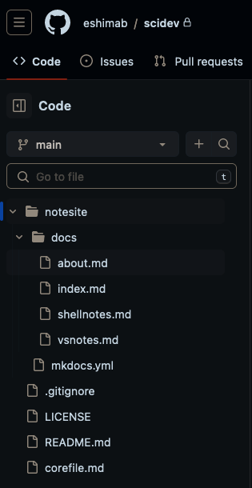
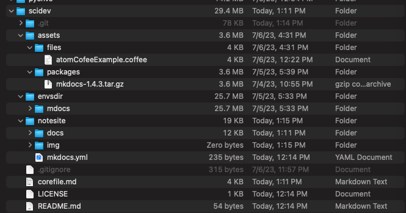
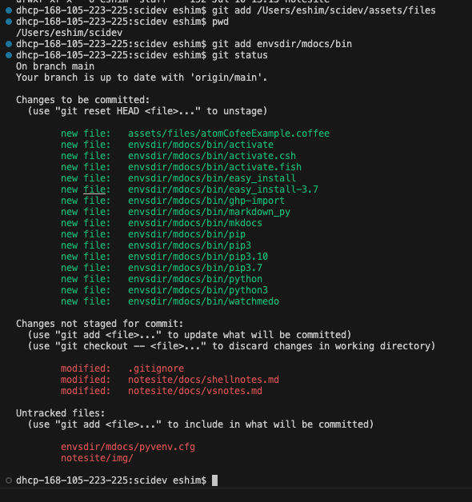
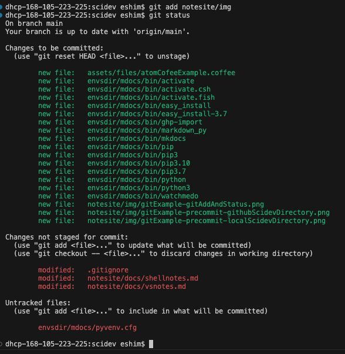
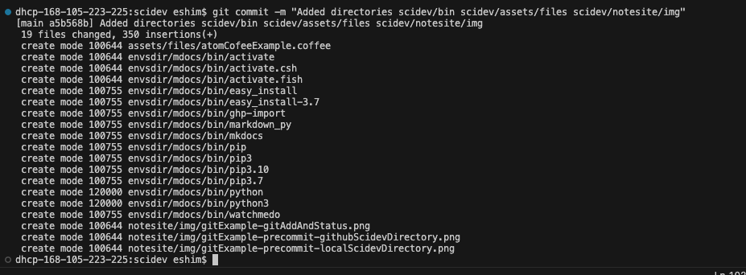
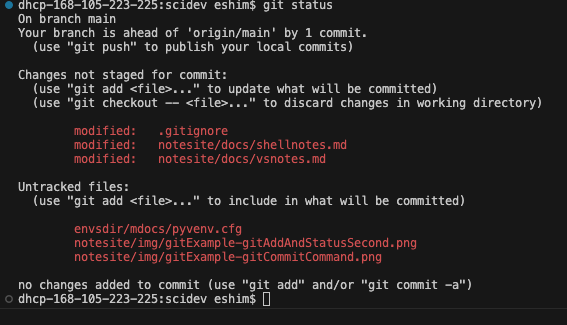
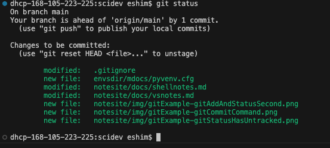
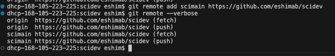
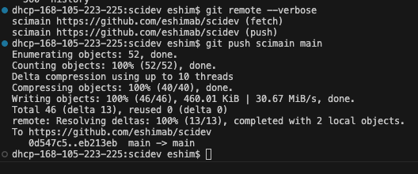
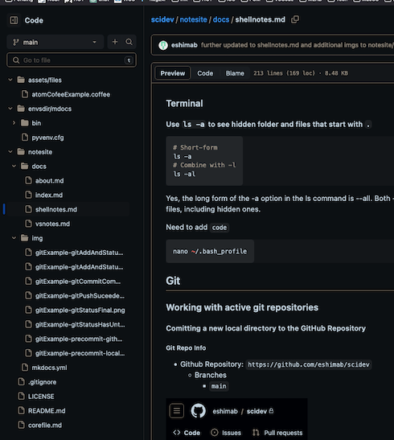

# Git

## Working with active git repositories

## Clone Remote Git Repository to Localhost Branch

```bash
cd ~/lifenotes

```

### Comitting a new local directory to the GitHub Repository

#### Git Repo Info
- Github Repository: `https://github.com/eshimab/scidev`
  - Branches
    - `main`




#### Local Git Branch `main`


See that the `assets` dir is located in the local `scidev`
```bash
dhcp-168-105-223-225:scidev eshim$ ls -la
total 56
drwxr-xr-x  11 eshim  staff    352 Jul 10 13:11 .
drwxr-xr-x@ 94 eshim  staff   3008 Jul 10 13:11 ..
-rw-r--r--@  1 eshim  staff  10244 Jul 10 13:49 .DS_Store
drwxr-xr-x  17 eshim  staff    544 Jul 10 13:51 .git
-rw-r--r--   1 eshim  staff    315 Jul  6 23:57 .gitignore
-rw-r--r--   1 eshim  staff   1062 Jul 10 12:14 LICENSE
-rw-r--r--   1 eshim  staff     54 Jul 10 12:14 README.md
drwxr-xr-x   5 eshim  staff    160 Jul  6 16:31 assets
-rw-r--r--   1 eshim  staff   3713 Jul 10 13:11 corefile.md
drwxr-xr-x   4 eshim  staff    128 Jul  5 17:33 envsdir
drwxr-xr-x   6 eshim  staff    192 Jul 10 13:15 notesite
dhcp-168-105-223-225:scidev eshim$ 
```

##### `git add` local dirs and files to prepare for the commit

We want to `git add` the directory `scidev/assets/files/` to our next `git commit`. 
Notes
   - The `-r` or `--recursive` flag is not necessary since Git automatically traverses directories recursively when adding files.
Starting in `~/scidev` directory
```bash
git add assets/files
git add envsdir/mdocs/bin
```
Check `git status`
```bash
git status
```
See Output:



**Example Repeat**: add `scidev/notesite/img/*` (start in `~/scidev`)
```bash
cd ~/scidev
git add notesite/img
```


##### Git Commit vs Push

In Git, a `commit` and a `push` are two separate operations that serve different purposes:

1. Git Commit:
   - Purpose: Creating a new commit to save your changes locally within your Git repository.
   - Usage: The `git commit` command is used to record your changes and create a new commit in your local repository. It captures the current state of your files, including any modifications, additions, or deletions. Each commit has a unique identifier and contains information such as the author, timestamp, and commit message describing the changes.
   - Local Operation: When you run `git commit`, the commit is created only within your local Git repository on your machine. It does not affect the remote repository or other collaborators' copies of the repository.

2. Git Push:
   - Purpose: Sending your local commits to a remote repository, typically hosted on a platform like GitHub, GitLab, or Bitbucket.
   - Usage: The `git push` command is used to upload your local commits to a remote repository. It transfers your committed changes from your local repository to the corresponding branch in the remote repository. This allows you to share your changes with others, collaborate on the project, and synchronize your work with the remote repository.
   - Remote Operation: When you run `git push`, Git sends your committed changes to the remote repository, updating the branch's commit history and files on the remote server. Other collaborators can then fetch or pull your changes into their own local repositories to incorporate your work.

In summary, a `commit` is a local operation that saves your changes within your local repository, while a `push` is used to send your local commits to a remote repository to share and synchronize your changes with others. Commits are made locally, and pushes are performed to update the remote repository with your local commits.


##### Create a local `git commit` to incorporate the changes done with `git add` or changes to files directly in `scidev` because we have been editting the branch `scidev/main`

Commit the directory changes and add a Commit Message using the `-m` flag
```bash
git commit -m "Added directories scidev/bin scidev/assets/files scidev/notesite/img"
```
See Output:


But we still have changes on files that were not added. This message was shown in `git status`



So we need to add these files with `git add`
```bash
# Go to main branch directory
cd ~/scidev
git add .gitignore
git add notesite
git add mdocs/pyvenv.cfg
```
See `git status` output



Now do another commit to `github.io/eshimab/scidev/main`
```bash
git commit -m "Updated notesite, added envsdir/mdoc/pyenvs.cfg, updated .gitignore"
```
See Output


### Managing GitHub Repository Url Aliases with `git remote`

We can check that the repository url is correct by using the `git remote` command with the `get-url` flag for the GitHub repository that we refer to with the local alias `origin`. You can think of `origin` as a short-hand for the repository url. The `origin` alis is created using the `git remote` command with the `add` option to define a local repository URL alias we will call `scimain` from the GitHub Repository 
```bash
git remote add scimain https://github.com/eshimab/scidev
```

List the available Repository URL Aliases using `git remote` without any additional arguments
   - Use the `--verbose` or `-v` flag to show additional info 
```bash
git remote --verbose
```
Output:



Now we can remove the old alias `origin` because it points to the same GitHub Repository URL as the new created alias `scimain`
   - Deleting the origin alias will not affect your connection to the remote repository as long as you have another valid remote alias configured.

```bash
git remote remove origin
## Check for changes
git remote --verbose
```

Output:
 


### Pushing Files with `git push`

##### `git push` the local `git commit` to the GitHub repo/branch `scidev/main` 

- Use the GitHub Repository URL alias `scimain` that points to the full URL `https://github.com/eshimab/scidev` (check this with `git remote --verbose`)

Push the commits done on the local branch `main` with `git push` to the GitHub Repository `scimain` (the alias for `http://github.com/eshimab/scidev`) 
```bash
git push scimain main
```
See output for checking the `git remote` alias name with the `--verbose` flag, then running the `git push` command, sending commits in the local branch `main` to the repository linked in the alias `scimain`.



And the GitHub webpage for `scidev/main` has been updated via the local machine `push`



## Summarizing Git Add/Commit/Push to Repository

1. Stage files with `git add`
   ```bash
   git add *
   ```
   1. Preview if desired with `git status`
2. Commit Staged files with `git commit`
   1. Add a commit message with `-m "message text"`
      ```bash
      git commit -m "updates to notesite"
      ```
3. Push the commit (containing the staged files) to the remote directory using `git remote <local-remote-alias> <local-branch-name>`
   ```bash
   git push scimain main
   ```
   1. You can list the local `<local-remote-alias>` avilable using `git remote --verbose`
      ```bash
      dhcp-168-105-223-225:scidev eshim$ git remote --verbose
      scimain https://github.com/eshimab/scidev (fetch)
      scimain https://github.com/eshimab/scidev (push)
      ``` 
   2. For the above example, the `<local-remote-alias>` is `scimain` and points to `https://github.io/eshimab/scidev`
   3. For this example, the `<local-branch-name>` is `main` and is recorded in the Github repo as `scidev/main` See that we are on branch `main` using `git status`
      ```bash
      dhcp-168-105-223-225:scidev eshim$ git status
      On branch main
      Changes not staged for commit:
      (use "git add <file>..." to update what will be committed)
      (use "git checkout -- <file>..." to discard changes in working directory)

        modified:   notesite/docs/shellnotes.md
       
      no changes added to commit (use "git add" and/or "git commit -a")
      dhcp-168-105-223-225:scidev eshim$ 
      ``` 
4. See Output from `git push scimain main`
   ```bash
   dhcp-168-105-223-225:scidev eshim$ git push scimain main
   Enumerating objects: 15, done.
   Counting objects: 100% (15/15), done.
   Delta compression using up to 10 threads
   Compressing objects: 100% (10/10), done.
   Writing objects: 100% (10/10), 237.52 KiB | 33.93 MiB/s, done.
   Total 10 (delta 4), reused 0 (delta 0)
   remote: Resolving deltas: 100% (4/4), completed with 4 local objects.
   To https://github.com/eshimab/scidev
      eb213eb..4d8a21e  main -> main
   dhcp-168-105-223-225:scidev eshim$
   ```
---

### More standard git setups

#### Adding git hooks

```bash
cd ~/scidev
git add .git/hooks/pre-commit
git add .git/hooks/post-commit
```

---
---

### Adding and updating files and directories to an established git repo

### Initializing a git repo using a local directory (with a generic, empty repo already on GitHub)

To use your local "scidev" folder to update your GitHub repository named "scidev" while creating a .gitignore file and a pre-commit Git hook to limit staging to files below 1MB, follow these steps:

- [ ]  Create the .gitignore file:
   - [ ] Open a text editor and create a file named ".gitignore" in the root directory of your "scidev" folder.
   - [ ] Add the necessary patterns to ignore files in the .gitignore file. For example, you can add `*.pdf` to ignore all PDF files.
    ```bash
    # Ignore directories withim scidev:
    # The leading / means that these are subdirectories within scidev where the .gitignore file is found
    # The trailing / means that we are targetting a directory and all it's contents
    /assets/packages/
    /envsdir/mdocs/bin/
    /envsdir/mdocs/lib/
    # 
    # Ignore Filetypes
    *.pdf
    *.mat
    ```
- [ ] Create the pre-commit Git hook:
   - [ ] Open a text editor and create a file named "pre-commit" (without an extension) in the ".git/hooks" directory of your "scidev" repository.
    ```bash
    touch /Users/eshim/scidev/.git/hooks/pre-commit
    ```
   - [ ] Copy and paste the following script into the "pre-commit" file:
     ```bash
     #!/bin/bash
     
     MAX_FILE_SIZE=1048576  # 1MB in bytes
     
     # Get the list of staged files
     files=$(git diff --cached --name-only)
     
     # Loop through the staged files
     for file in $files; do
       # Get the file size in bytes
       file_size=$(wc -c < "$file")
       
       # Compare file size with the maximum size
       if [ "$file_size" -gt "$MAX_FILE_SIZE" ]; then
         # Remove the file from the staging area
         git reset HEAD "$file"
         echo "File $file exceeds the maximum file size limit. It has been excluded from the commit."
       fi
     done
     #
     exit 0
     ```
   - [ ] Save the file and make it executable by running the following command in the terminal:
      ```bash
      chmod +x /Users/eshim/scidev/.git/hooks/pre-commit
      ```
- [ ] Initialize Git and connect to your GitHub repository:
   - [ ] Open a terminal or command prompt and navigate to your "scidev" folder.
       ```bash
       cd /Users/eshim/scidev
       ``` 
   - [ ] Run the following commands:
     ```bash
     git init
     git remote add origin https://github.com/eshimab/scidev
     ```
   - [ ] Replace `<repository-url>` with the URL of your GitHub repository.
- [ ] Add and commit files:
   - [ ] Add the files you want to include in the commit using `git add`.
   - [ ] Commit the changes using `git commit -m "Initial commit"`.

   ```bash
   git add notesite/**
   git commit -m "Initial Commit for directory notesite/**"
   ``` 

With these steps, your local "scidev" folder will be updated with the .gitignore file and the pre-commit Git hook. The pre-commit hook will exclude files above 1MB from being staged in your commits. Remember to customize the MAX_FILE_SIZE variable in the pre-commit script if you want a different maximum file size limit.

