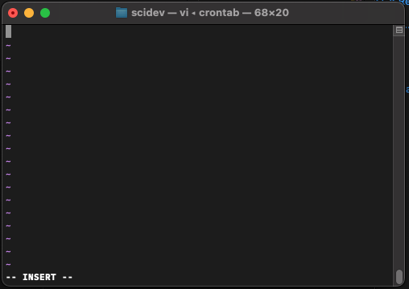
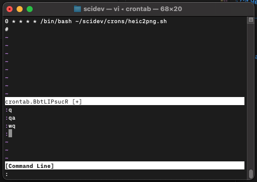

# Terminal

## Use `ls -a` to see hidden folder and files that start with `.` 

```bash
# Short-form
ls -a
# Combine with -l
ls -al
```

Yes, the long form of the -a option in the ls command is --all. Both -a and --all have the same functionality of showing all files, including hidden ones.

Need to add `code`
```bash
nano ~/.bash_profile
```

## Creating a Cronjob for a Shell Script

1. Write `shell` script `~/scidev/heic2png.sh` for converting `~/Downloads/$filename.HEIC` to `~/screenshots/$filename.png`.
    ```bash
      #!/bin/bash
      # Specify the input directory containing HEIC files
      input_directory="/Users/eshim/Downloads"
      # Create an output directory for the converted PNG files
      output_directory="/Users/eshim/screenshots"
      # Convert HEIC files to PNG
      for file in "$input_directory"/*.HEIC; do
          filename=$(basename "$file")
          output_file="$output_directory/${filename%.*}.png"
          sips -s format png "$file" --out "$output_file"
      done
      echo "Conversion complete!"  
    ```
2. Make `~/scidev/heic2png.s` executable with command: `chmod +x ~/scidev/heic2png.sh`
3. Open the crontab in terminal with `crontab -e`  using the `-e` flag to denote we are editing the Crontab
4. Use `vim` to edit the crontab. You Start in Command Mode (see the `-- INSERT --`) at bottom of window

    
5. Press `i` to enable text editing. Add the following line to the `crontab`
    ```bash
      * * * * * /bin/bash ~/scidev/heic2png.sh
    ``` 
    1. This tells to cronjob to run every minute
6. Exit the Text Insertion Mode by pressing `esc`
7. Exit the vim by typing `:wq` To `write` to file and `quit` editor

    
8. 

Cronjob Starting Process:


